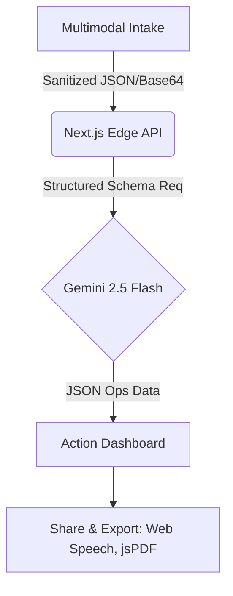

# AURA BRIDGE 🚨

**Aura Bridge** is a professional-grade emergency triage platform that transforms chaotic, unstructured input (voice, text, panic photos) into prioritized, structured operations data. 

[👉 **View Live Demo**](https://aura-bridge-402185195446.us-central1.run.app)

This project was built during the SuperHack 2025 sprint.

## 🏛️ Architecture & Services


**Google Cloud Services Powered:**
*   **Google Gemini 2.5 Flash API** (Generative AI)
*   **Google Cloud Run** (Serverless Container Deployment)
*   **Google Maps Static API** (Incident Triangulation)

## 📸 Screenshots
*(Add Live dashboard screenshots here)*
- Multimodal Ops Intake
- Threat Assessment Dashboard
- PDF Log Export

## 🚀 Features

- **Agentic AI Triage**: Powered by **Gemini 2.5 Flash** for high-speed reasoning and information extraction.
- **Multimodal Panic Intake**: Accepts raw text or drag-and-drop "panic photos", plus Web Speech Voice UI.
- **Deterministic Output**: Uses Gemini Structured Outputs to ensure JSON-structured emergency checklists never fail.
- **Professional Ops UI**: Clean, accessible command-center aesthetic.
- **Instant Transmission**: Easily share technical Medic Briefs securely to WhatsApp or download PDF Logs.
- **Live Triangulation Mock**: Integrated Google Maps for incident location awareness.

## 🛠️ Technology Stack

- **Framework**: Next.js 14 (App Router)
- **AI Engine**: Google Generative AI (`@google/generative-ai` models/gemini-2.5-flash)
- **Security**: DOMPurify, Content-Security-Policy Headers
- **Styling**: Tailwind CSS v4 (Custom Emergency Ops Tokens)
- **Animations**: Framer Motion
- **Deployment**: Google Cloud Run

## 🔌 Environment Setup

Create a `.env.local` file with the following variables:

```bash
GEMINI_API_KEY="your_google_ai_studio_key"
NEXT_PUBLIC_GOOGLE_MAPS_KEY="your_google_maps_key"
```

## 🏁 Getting Started

Run the development server locally:

```bash
npm run dev
```

Visit [http://localhost:3000](http://localhost:3000) to access the Panic Intake UI.

## ☁️ Deployment

This project is configured for continuous deployment on **Google Cloud Run**.

```bash
gcloud run deploy aura-bridge \
  --source . \
  --project YOUR_PROJECT_ID \
  --region us-central1 \
  --allow-unauthenticated \
  --set-env-vars "GEMINI_API_KEY=...,NEXT_PUBLIC_GOOGLE_MAPS_KEY=..."
```

## 🛡️ Hackathon Goals
- **Problem**: Critical time is wasted deciphering disorganized panic signals.
- **Solution**: An agentic bridge that structures "the noise" and tells the user what to do immediately.
- **USP**: Human-in-the-loop actioning, closed-loop processing, and sophisticated ops UI design.
