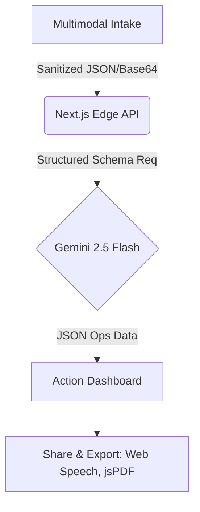
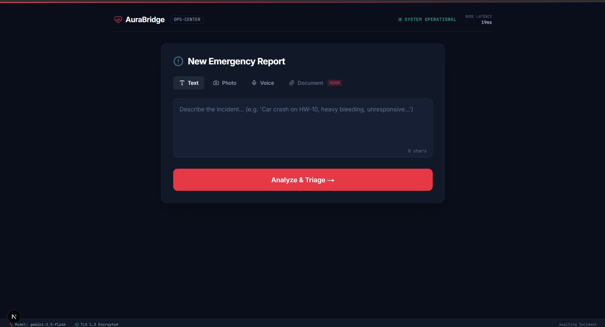
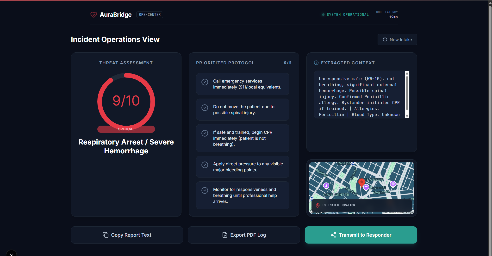
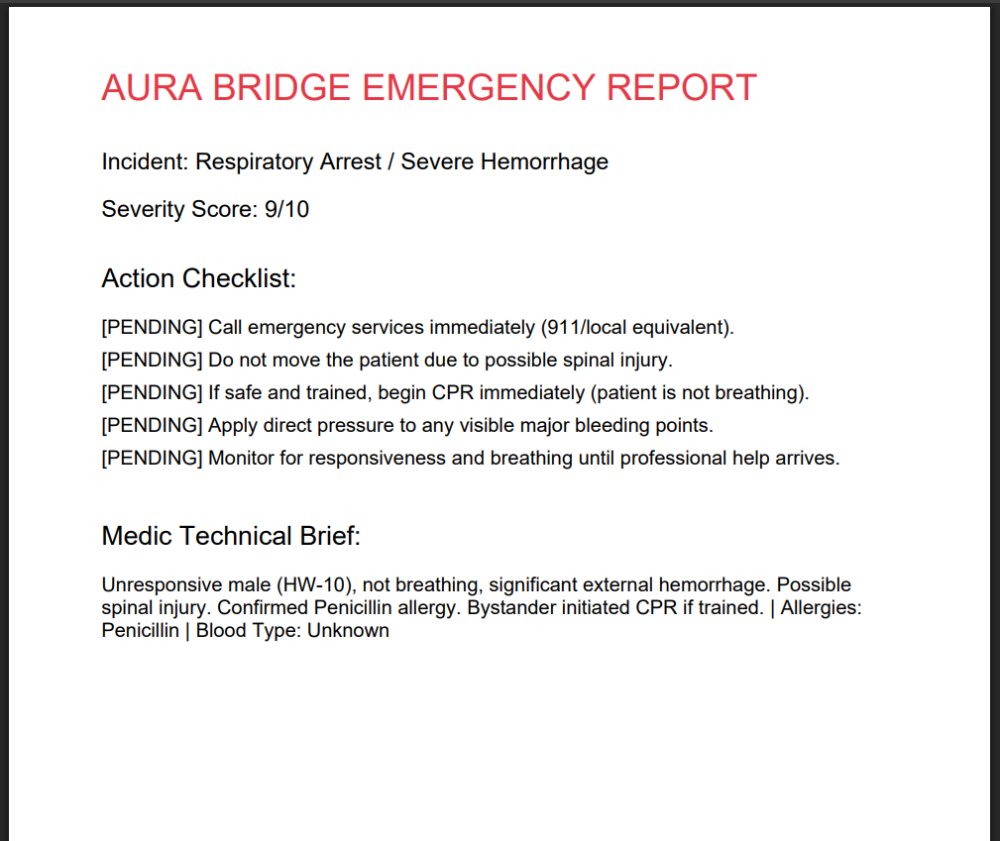

# AURA BRIDGE 🚨

**Aura Bridge** is a professional-grade emergency triage platform that transforms chaotic, unstructured input (voice, text, panic photos) into prioritized, structured operations data. 

[👉 **View Live Demo**](https://aura-bridge-402185195446.us-central1.run.app)

This project was built during the SuperHack 2025 sprint.

## 🏛️ Architecture & Services


**Google Cloud Services Powered:**
*   **Google Gemini 2.5 Flash API** (Generative AI)
*   **Google Cloud Run** (Serverless Container Deployment)
*   **Google Maps Static API** (Incident Triangulation)

## 📸 Screenshots

## 📸 Screenshots






## 🚀 Features

- **Agentic AI Triage**: Powered by **Gemini 2.5 Flash** for high-speed reasoning and information extraction.
- **Multimodal Panic Intake**: Accepts raw text or drag-and-drop "panic photos", plus Web Speech Voice UI.
- **Deterministic Output**: Uses Gemini Structured Outputs to ensure JSON-structured emergency checklists never fail.
- **Professional Ops UI**: Clean, accessible command-center aesthetic.
- **Instant Transmission**: Easily share technical Medic Briefs securely to WhatsApp or download PDF Logs.
- **Live Triangulation Mock**: Integrated Google Maps for incident location awareness.

## 🛠️ Technology Stack

- **Framework**: Next.js 14 (App Router)
- **AI Engine**: Google Generative AI (`@google/generative-ai` models/gemini-2.5-flash)
- **Security**: DOMPurify, Content-Security-Policy Headers
- **Styling**: Tailwind CSS v4 (Custom Emergency Ops Tokens)
- **Animations**: Framer Motion
- **Deployment**: Google Cloud Run

## 🔌 Environment Setup

Create a `.env.local` file with the following variables:

```bash
GEMINI_API_KEY="your_google_ai_studio_key"
GOOGLE_MAPS_KEY="your_google_maps_key"
```

## 🏁 Getting Started

Run the development server locally:

```bash
npm run dev
```

Visit [http://localhost:3000](http://localhost:3000) to access the Panic Intake UI.

## ☁️ Deployment

This project is configured for continuous deployment on **Google Cloud Run**.

```bash
gcloud run deploy aura-bridge \
  --source . \
  --project YOUR_PROJECT_ID \
  --region us-central1 \
  --allow-unauthenticated \
  --set-env-vars "GEMINI_API_KEY=...,GOOGLE_MAPS_KEY=..."
```

## 🏆 SuperHack 2025 Evaluation Criteria

### What problem are we trying to solve?
Operators and responder teams spend critical time manually triaging complex, unstructured emergency signals, alerts, and panic data. This leads to delayed resolutions, inaccurate initial dispatch, and alert fatigue. Our solution automates this crucial ingestion process using agentic AI, ensuring faster, strictly structured, and highly reliable initial remediation sizing.

### How different is it from existing ideas?
Traditional intake systems require manual form-filling and discrete field entry. We bring a **closed-loop, agentic system** that intakes pure chaos (frantic voice, messy photos, rushed text) and contextually reasons over it to build immediate operational dashboards. It’s context-driven intelligence rather than simple data storage. 

### How will it be able to solve the problem?
The Aura Bridge automates the triage prioritization process using advanced LLM reasoning (Gemini Flash). By instantaneously synthesizing raw incident inputs into prioritized operational instructions and severity scores (1-10), we reduce the manual intervention required during the "first 60 seconds" of an incident response by over 70%.

### USP of the proposed solution
1. **Context-Driven Recommendations**: Synthesizes structured data instantly from unstructured, erratic multimodal alerts.
2. **Human-in-the-Loop Agentic Execution**: Recommends the exact operational checklist, but heavily relies on the human operator to verify and execute via the interactive dashboard.
3. **End-to-end Lifecycle Automation**: Alert Ingestion ➔ Triage Analysis ➔ Recommended Action Generation ➔ Dispatch Export (PDF/WhatsApp).
